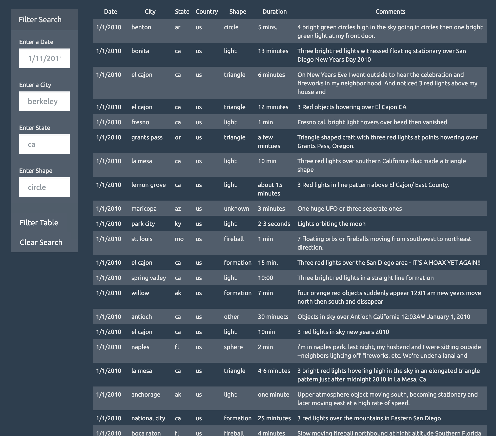
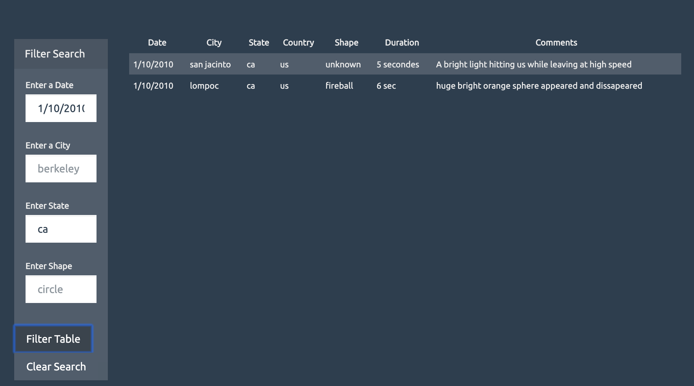

# JavaScript and DOM Manipulation
# UFO Sightings

## Background

WAKE UP SHEEPLE! The extra-terrestrial menace has come to Earth and we here at `ALIENS-R-REAL` have collected all of the eye-witness reports we could to prove it! All we need to do now is put this information online for the world to see and then the matter will finally be put to rest.

There is just one tiny problem though... our collection is too large to search through manually. Even our most dedicated followers are complaining that they are having trouble locating specific reports in this mess.

## UFO Sighting App

To provide an easy way to search through the observation, an appication was created to create a dynamic table. Javascript, HTML, CSS and D3.js were used to created the website.

We also provide user search function, in which, user can to set multiple filters and search for UFO sightings using the following criteria based on the table columns:

  1. `date/time`
  2. `city`
  3. `state`
  4. `country`
  5. `shape`

After provide search criteria, users will simply click Filter Table button to search UFO Sighting aviable. When users want to provide new search input, they can click "Clear Search" button to clear old filter criteria. Once the "Clear Search" button is clicked, all search inputs will be cleared and table will be reset to display all available UFO observations.